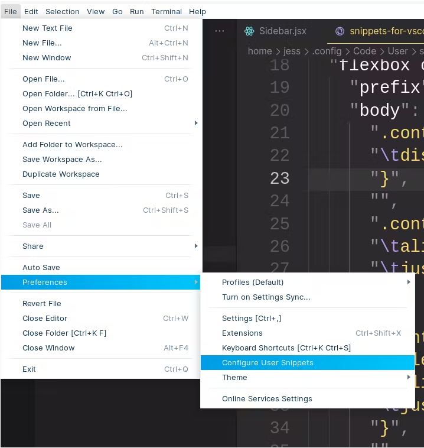
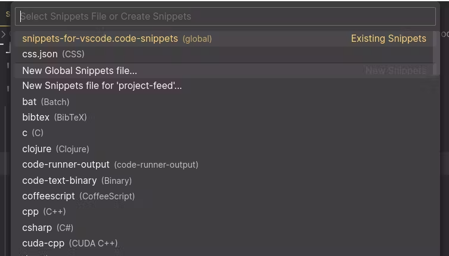
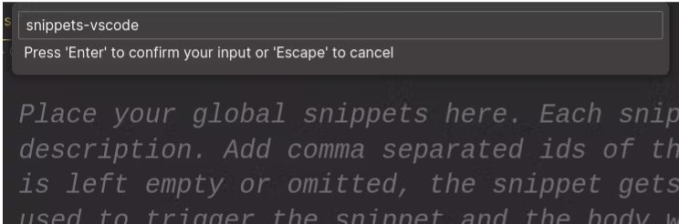

# Como criar seus próprios snippets no VS Code

Primeiramente, vamos entender o que são os snippets. Eles são blocos de código que agilizam o desenvolvimento do seu código. Na maioria das vezes, usamos extensões que configuram snippets, como, por exemplo, Vue VSCode Snippets e Reactjs code snippets.

No entanto, o objetivo deste tutorial é ensinar você a criar seus próprios snippets para o VSCode. Siga os passos abaixo:

### 1. Abra o VSCode e vá em File > Preferences > Configure User Snippets.

<p align="left">
  
</p>

### 2. Em seguida, um modal irá abrir para você escolher a linguagem na qual deseja criar um snippet. No nosso caso, vamos selecionar a opção New Global Snippets file... para criar um snippet que funcione para todas as linguagens.

<p align="left">
  
</p>


### 3. Agora, você precisa escolher um nome para o arquivo de snippets. Vamos chamá-lo de "snippets-vscode" e aperte Enter.

<p align="left">
  
</p>


### 4. Após selecionar o nome, um arquivo será aberto com um exemplo de snippet. Descomente-o para começar a editar.

Na pasta snippets deste repositório, copie o conteudo de python.json e cole.
```json
"Duckdb to export": {
    "prefix": "d_export",
    "body": [
        "con.execute(f\"copy s1.tbl_selected to './src/data/tbl_selected.parquet' (format 'parquet', CODEC 'zstd')\")",			
    ],
    "description": "Export table to parquet"
	},		
```

### Explicação dos campos do snippet:

- "Duckdb to export" é o nome que irá aparecer ao chamar o snippet.
- O campo _"prefix"_ é o apelido ou nome do snippet que você usará para ativá-lo.
- O campo _"body"_ deve conter todo o código que você deseja inserir no snippet.
Os trechos de código devem estar entre aspas e separados por vírgulas.
- O campo _"description"_ é uma simples descrição do comando.

### Atalhos Criados:

- d_export: seleciona uma tabela e exporta em formato.parquet.
- d_create: cria uma tabela.
- d_execute: Ação de executar uma query.
- d_tables: Semelhante a show tables.
- d_describe: descrição de uma tabela.
- d_query: Query inicial, com limit 2, e formato tabular.
- d_upload: Para inclusão de uma tabela do DuckDb para Mysql.
- d_vacuum: reorganização de indexão e fechamento de conexão com DuckDb.

---

Espero ter ajudado. ❤

Agora você pode criar seus próprios snippets personalizados no VSCode para agilizar seu desenvolvimento! 